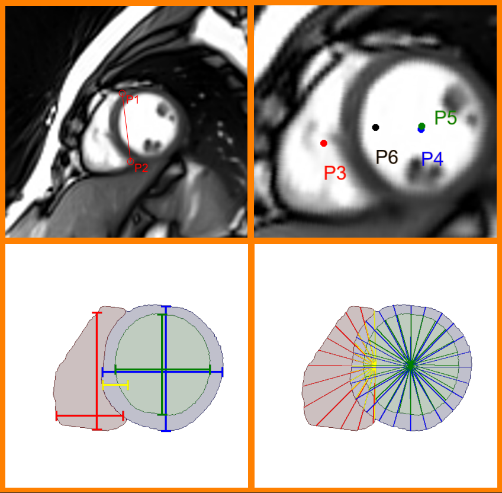
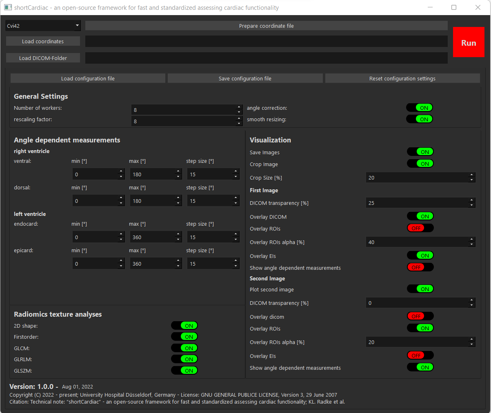
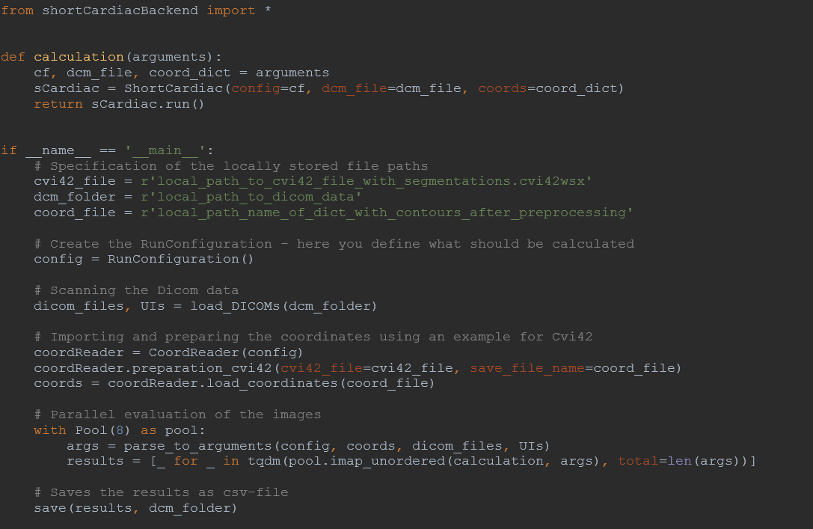

# <p style='color:darkred'> shortCardiac  </p>

### standardized, simplified and accelerated - cardiac evaluation of tomorrow

---
Please note that `shortCardiac` is not a medical product and should not be used as a substitute for professional medical advice or diagnosis. --

---

## Overview
#### I. [What is shortCardiac?](#what)
#### II. [Step-by-Step Installation](#install)
#### III. [Step-by-Step Usage](#usage)
#### IV. [Contributing](#Contributing)
#### V. [License](#License)

<a name="what"></a>
## <p style='color:darkred'> I. What is shortCardiac?

`shortCardiac` is an open-source framework implemented in Python that standardizes, simplifies, and accelerates the
analysis of short-axis view cardiac magnetic resonance images (MRI). The framework is provided as Python source code,
JupyterNotebook, and user-friendly Graphical User Interface (GUI). Based on the segmentation of the heart,
length, area, and centroid measurements are performed. In addition, [pyradiomics](https://www.radiomics.io/pyradiomics.html)
is implemented to allow the extraction of additional image features based on DICOM gray values.
Calculations have been validated by manual reference measurements and all mathematical measurements as well as transformations to
SI units were checked by [Unittests](https://docs.python.org/3/library/unittest.html).

<b>Hint:</b> shortCardiac allows the import of [Circle Cvi42](https://www.circlecvi.com/) coordinates / segmentations, which enables an easy implementation in current research projects.


*For queries and suggestions:*
[E-Mail](mailto:ludger.radke@med.uni-duesseldorf.de?subject=[GitHub]%20Source%20Han%20Sans);
[Linkedin](https://www.linkedin.com/in/ludger-radke/);
[ResearchGate](https://www.researchgate.net/profile/Karl-Radke-2)

#### If you use `shortCardiac` please cite our paper:
```
Coming soon (hopefully)
```



<a name="install"></a>
## <p style='color:darkred'> II. Step-by-Step Installation

### Source Code

Please note that `shortCardiac` Source Code requires Python 3.7.

#### 1. Clone shortCardiac.

```Shell
git clone https://github.com/MPR-UKD/shortCardiac
```
#### 2. In the following, the cloned directory is called `shortCardiac`.
```Shell
cd shortCardiac
```
#### 3. install requirements.txt
```Shell
pip install -r requirements.txt
```
### Standalone executable (.exe)

#### 1. Click one of the two links below to download the EXE

[onedir](https://uni-duesseldorf.sciebo.de/s/t0cGBmPWojZ5XBQ) - one-folder bundle containing an executable

[onefile](https://uni-duesseldorf.sciebo.de/s/fXxX5EoOr5efYEW) - a bundled executable file (note: starting the exe file takes time, because the file has to be unpacked first)

<a name="usage"></a>
## <p style='color:darkred'> III. Step-by-Step Usage

#### 1. Start Graphical User Interface (GUI)
```Shell
python GUIshortCardiac.py
```
or
```Shell
GUIshortCardiac.exe
```



Alternatively: *The framework can also be started via a separate main script or as JupyterNotebook. In `demo.py`, you will find a template how such a script should look and the Jupyternotebook is located in `shortCardiac.ipynb`.*



#### 2. Choice coordinate format

- In the top left corner, you can select the format of coordinates.
- currently implemented: [CVI42](), [ITKSnap]() and all other frameworks which safe segmentation as *nii.gz*.


#### 3. Load coordinates

- With the bottom "Load coordinates" a file dialog started. Now you can select the *coordinate file*.

#### 4. Select the DICOM root folder

- Analog to Point 3, with the bottom "Load DICOM Folder" a dialog will open. Please select the directory where the DICOM files are stored.
- Hint: DICOM files could be saved in subfolders. Short cardiacStarted in root search all DICOM files in the directory and all subdirectories.

#### 5. optional - Customize calculation

#### 6. Start Calculation

- push the "Run" bottom to start the calculation
- Now, shortCardiac search all DICOM images, merge DICOM images and segmentation, start the calculation of Parameters and save overlayed Images with Parameters (if selected) and write all calculations in a CSV-File for further evaluations

#### 7. Publish your next Paper with shortCardiac :)

### Alternative: You can also change the SoruceCode directly or use the Jupyter notebook.

Notes: Python version 3.7 is required to use the Jupyternotebook (specifically the pyradiomics package). The easiest way is to use a virtual interpreter. Here is described how to set one up: [venv-in-JupyterLab](https://medium.com/@laquesisa/virtual-environment-in-jupyter-lab-8b3815ba9662)


<a name="Contributing"></a>
## <p style='color:darkred'> IV. Contributing
Pull requests, requests to implement more calculations, and to integrate other segmentation frameworks are welcome. Please open an issue to discuss what you want to change for significant changes.

<a name="License"></a>
## <p style='color:darkred'> V. License
[GNU General Public License 3](https://www.gnu.org/licenses/gpl-3.0.html)

The GNU General Public License is a free, copyleft license for software and other kinds of works.

### Git hocks
Install "pre-commit"
```bash
pip install pre-commit
```

then run:
```bash
pre-commit install
```
